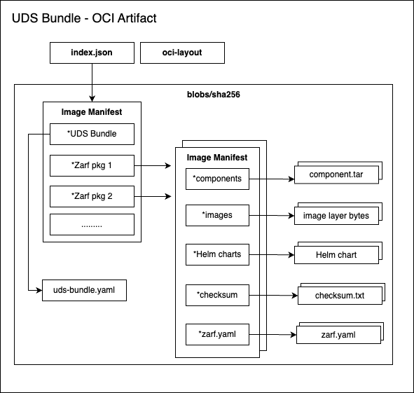

# UDS Overview

# High-level overview

UDS is a packaging framework that allows end users to meet stringent requirements for obtaining an Authority to Operate (ATO). 

It leverages several open standards like OSCAL to enable this support while blending in other OSS software from Defense Unicorns like Zarf, Pepr and Lula. 

UDS has several core packages it bundles together to enable this goal

**Core Applications**

- [Authservice](https://github.com/istio-ecosystem/authservice) - Authorization
- [Grafana](https://grafana.com/oss/grafana/) - Monitoring
- [Istio](https://istio.io/) - Service Mesh
- [KeyCloak](https://www.keycloak.org/) - Identity & Access Management
- [Loki](https://grafana.com/oss/loki/) - Log Aggregation
- [Metrics Server](https://github.com/kubernetes-sigs/metrics-server) - Metrics
- [Neuvector](https://open-docs.neuvector.com/) - Container Security
- [Pepr](https://pepr.dev/) - UDS policy engine & operator
- [Prometheus Stack](https://github.com/prometheus-operator/kube-prometheus) - Monitoring
- [Vector](https://vector.dev/) - Log Aggregation
- [Velero](https://velero.io/) - Backup & Restore

## UDS bundles

A core concept in UDS are **bundles**. Bundles allow replicable configuration of UDS deployments. A UDS bundle is very similar to Helm but more opinionated and specific. 

Firstly, UDS bundles require Zarf. Zarf handles the pulling and packaging of images into a large OCI artifact. 

> OCI artifacts are set of standards used by the Open Container Initative to store arbitrary files
>

## Key differences

- UDS is more opinionated than Helm and the UDS-core specifies a set of applications along with a custom operator
- UDS leverages an operator with CRDs to simiply the deployment of applications with UDS
  - For example, Istio Virtual services can be configured by
  [Package CR](https://uds.defenseunicorns.com/reference/configuration/custom-resources/packages-v1alpha1-cr/)
  - This explicitly HAS LESS FLEXIBILITY than the native Istio virtual service options
  - ie, no support for [HTTPFaultInjection](https://istio.io/latest/docs/reference/config/networking/virtual-service/#HTTPFaultInjection)
- This fast pace leads to a breaking changes. UDS is not a stable API and is subject to change.
    There have been several breaking changes in the release notes.

## Takeaways

- UDS follows the standard Kubernetes maturity model where abstractions are added to simplify
 desired patterns.
- Local first development with class-leading packaging with Zarf allows UDS bundles to be very portable.
- Zarf allows for airgap to be a trivial concern.
- UDS supports [flavors](https://uds.defenseunicorns.com/reference/deployment/flavors/) that allow different upstream images
to be used
- CLI driven workflows are a first class citizen in UDS, with a multitude of pre-built configurations.
- An explicitly limited scope allows for more direct focus on the user experience and not package management.
  - This is a double edged sword as a user that strays off the beaten path to integrate another package will need to 
    learn how to integrate a package with UDS.
  - Arguable easier than integrating with Bigbang though as the process is more explicit
- UDS CLI contains other binary tools like `zarf` which allows for additional abstraction

## Ways UDS could improve

- Stronger support for GitOps based workflows.
  - Not seeing flux or ArgoCD here was a suprise. Not very clear how UDS would support different teams with
    different upgrade cadences. Feels like you would need to create a new bundle for each update. 
- Day 2 operations. UDS is very much a deployment tool. Operations feels like it would be a separate concern.

## Changes that should come to Bigbang

1. Stronger dogfooding of Bigbang. Our dev script should be sunset in favor of a "quickstart" that
end users are able to follow.
2. Creation of standard opinionated configurations. UDS has UDS-core and a slim version. The
creation of additional bundles with specific configurations is a first class workflow. The equivalent in bigbang would
be having multiple values.yaml files. 
3. CLI driven instead of using bash/helm. This would set the platform for creating our own abstractions.
4. Creation of bigbang CRDs such that an Operator could be created to manage the lifecycle of a bigbang deployment.
    1. Likely the most controversial as this would be a large investment. We could initially have the CLI operate on 
       this CRD.